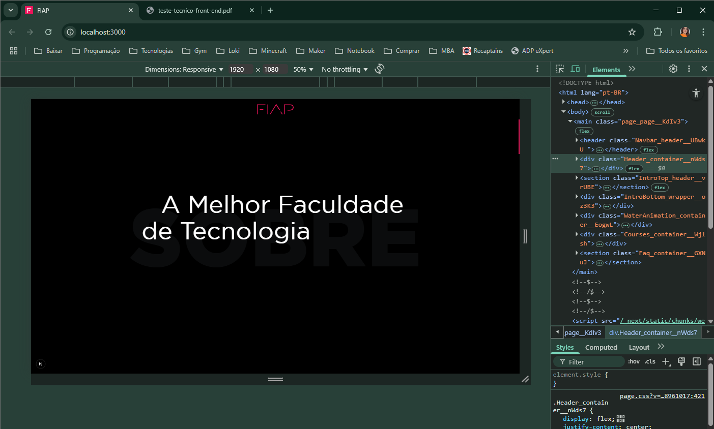
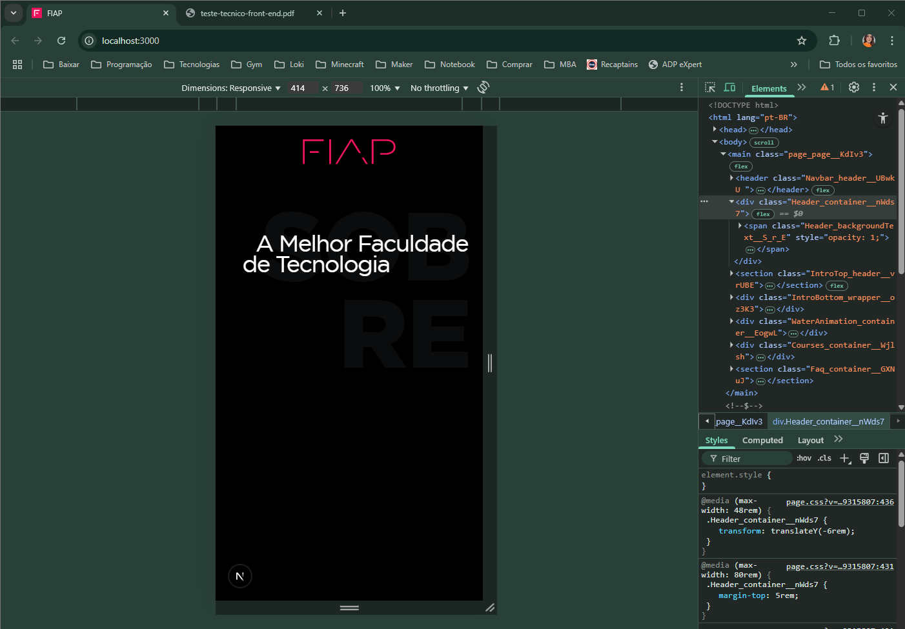
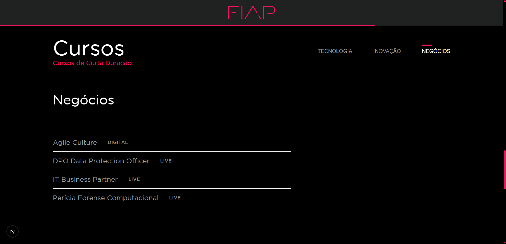
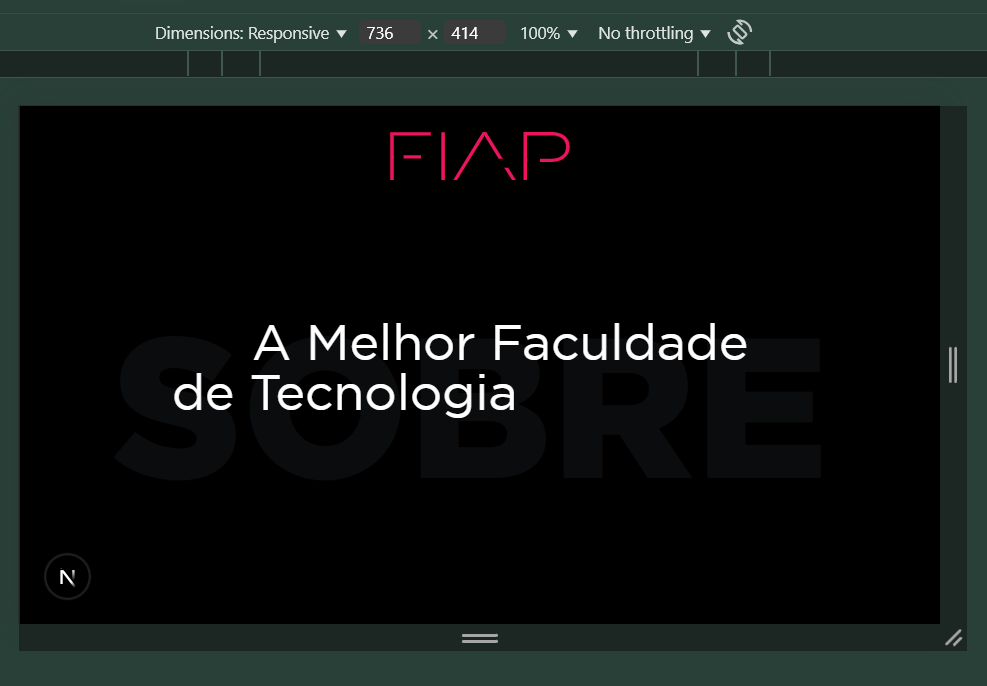

# 🧩 FIAP - Landing Page

Landing page desenvolvida como parte de uma avaliação técnica para vaga de Front-End Junior, com foco em performance, design responsivo e interatividade.

### 🖼️ Preview

| Desktop | Mobile |
|--------|--------|
|  |  |
|  |  |

## 📸 Layout de Referência

O design desta página foi baseado em um protótipo fornecido no Figma.  
[Visualizar protótipo no Figma](https://www.figma.com/design/aAAuhPpxsfmd1Lb18R2qcz/Teste-T%C3%A9cnico-Front-end---FIAP?node-id=0-1&p=f&t=b63ygSEUA8wq5rSK-0)

## 🧪 Tecnologias

Este projeto foi desenvolvido com as seguintes tecnologias:

- [React](https://react.dev)
- [Next.js](https://nextjs.org)
- [TypeScript](https://www.typescriptlang.org)
- [SASS](https://sass-lang.com/)
- [GSAP](https://gsap.com)

## 💻 Requisitos

Antes de começar, verifique se você tem instalado:

- [Node.js](https://nodejs.org/) (recomendado: versão 18 ou superior)
- [Yarn](https://yarnpkg.com) ou [npm](https://www.npmjs.com/)

## 🚀 Como rodar o projeto

1. Clone o repositório:

```bash
git clone https://github.com/juliaassuncao/fiap-landing-page
```

2. Acesse a pasta do projeto:

```bash
cd fiap-landing-page
```

3. Instale as dependências:

```bash
yarn install
# ou
npm install
```

4. Inicie o servidor de desenvolvimento:

```bash
yarn dev
# ou
npm run dev
```

5. Abra no navegador:

```
http://localhost:3000
```

## 📝 Observação sobre o layout

Alguns valores de espaçamento e tipografia foram ajustados em relação ao Figma devido a pequenas inconsistências no layout original (como desalinhamentos ou medidas que não refletiam bem o visual mostrado no vídeo de referência). As mudanças foram feitas visando melhorar a harmonia visual na tela, sempre com respeito ao trabalho de design e apenas como sugestão de melhoria para implementação nos diversos tipos de telas que precisavam ser abrangidos.

## 👩‍💻 Autora

Desenvolvido por **Julia Assunção**  
📧 [E-mail FIAP](mailto:julia.silva@fiap.com.br)  
💼 [LinkedIn](https://www.linkedin.com/in/julia-assun%C3%A7%C3%A3o-8128aa158/)
